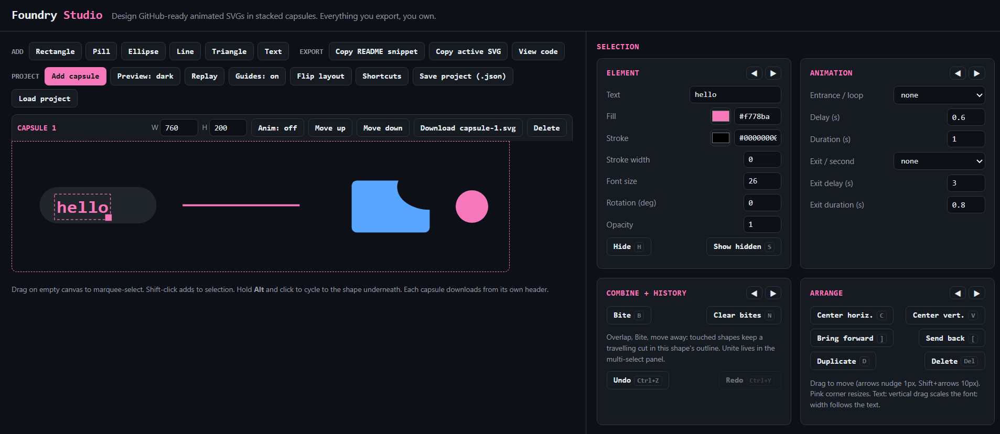

# FoundryStudio
Design GitHub-ready animated SVGs in stacked capsules. Everything you export, you own. 

[**Try it live**](https://luigalve.github.io/FoundryStudio/) | [View the source](https://github.com/luigalve/FoundryStudio/blob/main/index.html)
 
 

 

## Table of Contents

- [Quick start](#quick-start)
- [Top bar: Add, Project, & Export](#top-bar)
- [Capsule header](#capsule-header)
- [Canvas and mouse](#canvas-and-mouse)
- [Element panel](#element-panel)
- [Animation panel](#animation-panel)
- [Combine, history, and arrange](#combine-history-and-arrange)
- [Multi-select panel](#multi-select-panel)
- [Keys](#keys)
- [Seven things the buttons do not tell you](#seven-things-the-buttons-do-not-tell-you)
- [License](#license)

 
 
  

One HTML file. Open it in a browser and you have a visual editor: shapes, text, entrance and exit animations, travelling cuts, alignment guides, undo. Download the result as a self-contained SVG and commit it. No install, no build step, no npm, no account.

| What | Why it matters |
|---|---|
| Offline | The editor makes no network requests. Nothing you draw leaves your machine. |
| Zero dependency | One file, no framework, no build. Save it and it still opens in five years. |
| Safe to commit | The exported SVG carries no scripts and no external references, so GitHub renders it in a README without stripping anything. |
| Respects the reader | Every export ships a `prefers-reduced-motion` rule. The animation turns itself off for people who have asked for that. |
| Editable forever | Save a `project.json` and you can reopen and change any capsule later. |
 

## Quick start

1. Click here to try it live or download `index.html` and double click it to open it in a browser.
2. Add a shape. Give it an entrance, a delay, and an exit.
3. Click **Replay** to watch the whole capsule from zero.
4. Click **Download capsule-1.svg** in the capsule header and save it to `assets/`.
5. Click **Copy README snippet** and paste it into your README.
6. Click **Save project (.json)** before you close the tab. The SVG cannot be reopened. 

Capsules can be renamed but you must also change the REAMME snippet to match.
 
 

## Top bar
**Add, Project, and Export**

| Control | What it does | How to use / key |
|---|---|---|
| Rectangle, Pill, Ellipse, Line, Triangle, Text | Adds that shape to the active capsule and selects it | Click. Lands at x60 y60. Pill is a rect with the radius maxed. Line is stroke-only |
| Copy README snippet | Copies a centered `` block for every capsule | Click, paste into your README. It points at `./assets/capsule-N.svg`, so save your SVGs there |
| Copy active SVG | Copies the full SVG source of the active capsule | Click, paste anywhere |
| View code | Shows the active capsule's SVG source under the canvases | Click to open, click again (now "Hide code") to close |
| Add capsule | Adds a blank 760x200 capsule and makes it active | Click |
| Preview: dark / light | Switches the canvas background | Click to flip. Preview only. The export is transparent, so check your art on both |
| Replay | Restarts every animation in every capsule from zero | Click after any timing change |
| Guides: on / off | Snap-to-center alignment lines while dragging | Toggle. When on, the selection snaps to the canvas center and to other shapes' centers within 5px, with pink lines showing the match |
| Flip layout | Swaps the canvas column and the panel column | Click |
| Shortcuts | Opens the key table and lets you rebind | Click a key box, press a new key. Bindings save inside the project file |
| Save project (.json) | Downloads `project.json`: capsules, shapes, key bindings | Click. This is your editable source. An SVG cannot be reopened |
| Load project | Restores a `project.json` | Click, pick the file. Replaces everything and clears the undo history |
 

## Capsule header

One header per capsule.

| Control | What it does | How to use / key |
|---|---|---|
| W / H | Capsule canvas size in px | Type a number. Default 760 x 200 |
| Anim: on / off | Freezes that capsule's animations in the preview | Click. Preview only. The exported SVG still animates |
| Move up / Move down | Reorders capsules in the stack | Click. Order sets the numbering in the README snippet |
| Download capsule-N.svg | Saves that capsule as a standalone SVG | Click |
| Delete | Removes the capsule | Click. Deleting the last one empties it instead |
 

## Canvas and mouse

| Control | What it does | How to use / key |
|---|---|---|
| Click a shape | Selects the top shape under the pointer | Click |
| Alt + click | Cycles down through stacked shapes at that spot | Hold Alt and click again. Needs one shape already selected |
| Shift + click | Adds or removes a shape from the selection | Shift + click |
| Drag empty canvas | Marquee select | Drag a box. Anything it touches is selected |
| Drag a shape | Moves it, or the whole selection as one | Drag. Arrows nudge 1px, Shift + arrows 10px |
| Pink corner handle | Resize | One shape: bottom-right drag. Text: drag down to grow the font, width follows the text. Line: near-straight auto-snaps straight, Shift locks to 45 degree steps. Multi: scales the selection together, rotation ignored, so rotate afterward |
 

## Element panel

Shown when exactly one shape is selected.

| Control | What it does | How to use / key |
|---|---|---|
| Text | The string a text element renders | Type. Width follows the text |
| Fill / Stroke | Color picker plus a hex field | Pick, or type hex. 8 digits carries alpha: `#00000000` is fully transparent, which is how you get no fill |
| Stroke width | Outline thickness | Number. Must be above 0 for "draw stroke" to show anything |
| Corner radius | Rectangle rounding | Number. Rects only. Pill is already maxed |
| Font size | Text size in px | Number. Text only |
| Rotation (deg) | Rotates around the shape's center | Number. Rotation sits on a wrapper, so animations never overwrite it |
| Opacity | 0 to 1 | Number, 0.05 steps. Animations use this as their end state |
| Hide | Hides the selection without deleting it | Click, or `H` |
| Show hidden | Unhides everything, in every capsule | Click, or `S` |
 

## Animation panel

| Control | What it does | How to use / key |
|---|---|---|
| Entrance / loop | First thing the shape does: fade, zoom, bounce, four slides, draw stroke, typing, or any of the seven loops | Pick from the list. "draw stroke" needs a stroke. "typing" needs a text element |
| Delay (s) | Wait before the entrance starts | Number. Staggering delays across shapes is what makes a capsule read as a sequence |
| Duration (s) | How long the entrance takes | Number |
| Iterations | Loop repeat count, 0 = forever | Appears only when the entrance is a loop |
| Exit / second | Second thing the shape does: any out, undraw, untype, or any loop | Pick from the list. This is a full second slot, so "fade in, then wobble forever" is one element |
| Exit delay (s) | Wait before the exit fires | Number, default 3. Timed from zero, not from the end of the entrance |
| Exit duration (s) | How long the exit takes | Number |
| Exit iterations | Repeat count for a looping exit, 0 = forever | Appears only when the exit is a loop |
| Second color | The color "color pulse" pulses to | Appears only when the entrance or exit is color pulse |
 

## Combine, history, and arrange

| Control | What it does | How to use / key |
|---|---|---|
| Bite | The selected shape punches its own outline out of every shape it overlaps | Overlap, click Bite (`B`), move away. The cut belongs to the bitten shape and travels with it. Fills cut cleanly, strokes do not trace the cut. Text cannot bite |
| Clear bites | Removes every cut the selected shape has received | Click, or `N` |
| Undo / Redo | 60 steps. Drags and nudges collapse into one step | `Ctrl+Z` / `Ctrl+Y`, and `Ctrl+Shift+Z` also redoes |
| Center horiz. / Center vert. | Centers the shape in the capsule | Click, or `C` / `V` |
| Bring forward / Send back | Moves the shape one step through the stack | Click, or `]` / `[`. Later in the stack draws on top |
| Duplicate | Copies the shape 20px down and to the right | Click, or `D` |
| Delete | Deletes the selection | Click, or `Del` |
| Section arrows | Reorders the four panel sections in their grid | Click the arrows in a section header |
 

## Multi-select panel

Shown when two or more shapes are selected.

| Control | What it does | How to use / key |
|---|---|---|
| + delay, + duration, + exit delay, + exit duration, then Apply | Adds the value to each shape's own value, so an existing stagger survives | Type a number, click Apply. Negatives work: -0.5 pulls a whole sequence earlier without flattening it |
| Unite | Fuses the selection into one compound shape | Click, or `G`. Needs two or more non-text shapes. The result inherits the first shape's fill and animation |
| Hide | Hides everything selected | Click, or `H` |
| Delete | Deletes everything selected | Click, or `Del` |
 

## Keys

Rebindable defaults, changeable in the Shortcuts panel:

| Key | Action |
|---|---|
| `B` | Bite |
| `N` | Clear bites |
| `G` | Unite |
| `H` | Hide |
| `S` | Show hidden |
| `D` | Duplicate |
| `]` / `[` | Bring forward / Send back |
| `C` / `V` | Center horizontally / vertically |

Fixed, not rebindable:

| Key | Action |
|---|---|
| Arrows | Nudge 1px |
| Shift + arrows | Nudge 10px |
| `Del` or `Backspace` | Delete the selection |
| `Ctrl+Z` / `Ctrl+Y` | Undo / redo |
| Alt + click | Cycle down a stack of shapes |

Single keys never fire while the cursor is in a field, so they cannot eat text.
 

## Seven things the buttons do not tell you

1. Exit delay is absolute, counted from zero, not from the moment the entrance ends. If the entrance is delay 2 plus duration 1, any exit delay under 3 collides with it.
2. "Anim: off" is a preview freeze. The exported SVG still animates.
3. The preview background is not exported. The SVG is transparent, which is why the light and dark toggle exists.
4. Bite is directional. The selected shape is the knife, and the shapes it overlaps keep the cut. "Clear bites" clears cuts the selected shape received, not cuts it gave.
5. `project.json` is the only reopenable format. Save it before closing the tab.
6. Center, forward, back, duplicate, bite, and clear bites need exactly one shape selected. With a multi-selection they do nothing and say nothing.
7. Every export carries a `prefers-reduced-motion` rule, so the animation turns itself off for readers who have asked for that.

## License

MIT. Take it, fork it, ship it.
