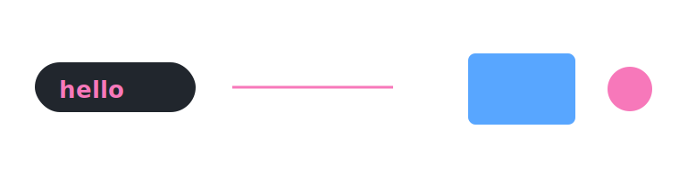

# FoundryStudio

Design GitHub-ready animated SVGs in stacked capsules. One HTML file, no dependencies, everything you export you own.

[**Try it live**](https://luigalve.github.io/FoundryStudio/) | [View the source](https://github.com/luigalve/FoundryStudio/blob/main/index.html)

 
 

 

## Why

|                  |                                                                                                                     |
| ---------------- | ------------------------------------------------------------------------------------------------------------------- |
| Zero dependency  | One file, no framework, no build, no signup.                                                                        |
| Offline          | Nothing you draw leaves your machine. Download it once, runs offline forever.                                       |
| Safe to commit   | Exports carry no scripts and no external references. GitHub renders them in a README without stripping anything. |
| Editable forever | Save a project.json and you can reopen and change any capsule later.                                                |

 

 
 

**This banner is a test.** FoundryStudio's exporter generated it. 

 

All six rows should animate. It restarts itself 2 seconds after it finishes the animation, so you should see it move. The grey labels never move, so a still row is a failed mechanism, not a failed file.
 

| Row     | Tests                                     | Fails as                                |
| ------- | ----------------------------------------- | --------------------------------------- |
| 1 slide | translate on a text node                  | text stuck above position, or missing   |
| 2 fade  | opacity                                   | text missing                            |
| 3 color | fill animation, one pass per cycle        | text never changes color                |
| 4 draw  | stroke-dashoffset with a real dash length | bar solid or dotted, never drawing      |
| 5 type  | textPath on a growing path                | text appears all at once, or not at all |
| 6 turn  | scale and rotate about center             | square static, or off position          |

If a row does not move on your device, open a [device report](../../issues/new?template=device-report.md).
 
 
 

---
 

## Quick start

1. [Jump right in](https://luigalve.github.io/FoundryStudio/) or, 
   view and download the [`index.html`  source file](https://github.com/luigalve/FoundryStudio/blob/main/index.html).
    Double click the downloaded file to open it in a browser.
>
2. Add **shapes**, **text**, and **animate**.
Give them an entrance, a delay, and an exit.
>
3. Add additional capsules.
> 
4. Click **Replay** to watch the capsule animation.
>
5. Click **Download capsule-#.svg** in the capsule header and save it to `assets/` in your repo.
>
6. Click **Copy README snippet** and paste it into your README.
>
7. Click **Save project (.json)** before you close the tab. The SVG alone cannot be reopened.

 

---
 

## Controls

### Top bar

| Control                                        | What it does                                                                            |
| ---------------------------------------------- | --------------------------------------------------------------------------------------- |
| Rectangle, Pill, Ellipse, Line, Triangle, Text | Adds the shape at the radius maxed. Line is stroke-only.                                |
| Copy README snippet                            | Copies a centered img block for the active capsule, pointing at `assets/capsule-N.svg`. |
| Copy active SVG                                | Copies the full SVG source of the active capsule.                                       |
| View code                                      | Shows the active capsule's SVG source under the canvases.                               |
| Add capsule                                    | Adds a blank 760x200 capsule and makes it active.                                       |
| Preview: dark / light                          | Switches the canvas background. The background is not exported.                         |
| Replay                                         | Restarts every animation from zero.                                                     |
| Guides                                         | Snap-to-center alignment lines while dragging, with pink lines showing the match.       |
| Flip layout                                    | Swaps the canvas column and the panel column.                                           |
| Shortcuts                                      | Opens the key table. Every binding is editable there.                                   |
| Save project (.json) / Load project            | The project file is the only reopenable format.                                         |

 

---
 

### Capsule header

| Control                | What it does                                                                                                                                                                                                                                         |
| ---------------------- | ---------------------------------------------------------------------------------------------------------------------------------------------------------------------------------------------------------------------------------------------------- |
| W / H                  | Capsule size in px. Default 760x200.                                                                                                                                                                                                                 |
| Anim: on / off         | Off shows the still image a renderer sees when it ignores animation. That picture is always the finished one.                                                                                                                                        |
| Loop                   | 0 plays the sequence once. Any other number restarts the whole sequence that many seconds after it finishes. GitHub starts SVG animation at page load, not when the reader scrolls to it, so a one-shot intro is usually over before anyone sees it. |
| Move up / down         | Reorders capsules on the page. Order sets the numbering in the README snippet.                                                                                                                                                                       |
| Download capsule-N.svg | Saves the capsule as a standalone SVG.                                                                                                                                                                                                               |
| Delete                 | Removes the capsule. Deleting the last one empties it instead.                                                                                                                                                                                       |

 

---
 

### Canvas and mouse

| Action               | What it does                                                                                               |
| -------------------- | ---------------------------------------------------------------------------------------------------------- |
| Click                | Selects a shape. Shift-click adds to the selection. Alt-click cycles down a stack of overlapping shapes.   |
| Drag on empty canvas | Marquee select. Anything it touches is selected.                                                           |
| Drag a shape         | Moves it, or the whole selection as one.                                                                   |
| Corner handle        | Resize. On text, drag down to grow the font. Lines stay straight, and Shift locks them to 45 degree steps. |
| Arrows               | Nudge 1 px. Shift-arrows nudge 10 px.                                                                      |

 

---
 

### Element panel

Shows the controls that apply to the selected shape.

| Control        | What it does                                                       |
| -------------- | ------------------------------------------------------------------ |
| Text           | The string. Editing refits the box.                                |
| Fill / Stroke  | Color pick, or type a hex. Type `none` for no paint.               |
| Outline        | Stroke width. Draw entrances need a stroke to draw.                |
| Corner radius  | Rectangles only. Pills are the radius maxed.                       |
| Font size      | Text only, in px.                                                  |
| Rotation (deg) | Rotates around the shape's center. Bites rotate with it.           |
| Hide           | Keeps the shape in the stack but out of the canvas and the export. |
| Opacity        | 0 to 1. This is the resting value, before any animation.           |

 

---
 

### Animation panel

| Control                                 | What it does                                                                                                                                            |
| --------------------------------------- | ------------------------------------------------------------------------------------------------------------------------------------------------------- |
| Entrance                                | First thing the shape does: fade, zoom, bounce, four slides, draw, typing, or any of the seven loops. Draw needs a stroke. Typing needs a text element. |
| Delay (s)                               | Wait before the entrance starts. Stagger delays across shapes to make a capsule read as a sequence.                                                     |
| Duration (s)                            | How long the entrance takes.                                                                                                                            |
| Iterations                              | For a loop entrance: 0 repeats forever, any other number runs that many passes.                                                                         |
| Exit + exit delay, duration, iterations | Same options, played on the way out. Exit delay is absolute, counted from zero.                                                                         |
| Second color                            | The color the color pulse swings to.                                                                                                                    |
| Blinking caret                          | Typing only. On by default.                                                                                                                             |

 

---
 

### Combine, history, and arrange

| Control                   | What it does                                                                                                                                                                   |
| ------------------------- | ------------------------------------------------------------------------------------------------------------------------------------------------------------------------------ |
| Bite                      | Punches the selected shape's outline out of every shape it overlaps. The cut belongs to the bitten shape and travels with it. Fills cut cleanly, strokes do not trace the cut. |
| Overlap                   | Two duplicates offset by a step, for quick layered looks.                                                                                                                      |
| Undo / Redo               | 60 steps. Drags and nudges collapse into one step.                                                                                                                             |
| Center horiz / vert       | Centers the shape in the capsule.                                                                                                                                              |
| Bring forward / Send back | Moves the shape one step through the stack.                                                                                                                                    |
| Duplicate                 | Copies the shape 20 px down and to the right.                                                                                                                                  |
| Delete                    | Deletes the selection.                                                                                                                                                         |
| Section arrows            | Reorders the panel sections. The layout is saved in the project file.                                                                                                          |

 

---
 

### Multi-select panel

_Visible when two or more shapes are selected._

With more than one shape selected, `+ delay`, `+ duration`, and `+ exit duration` add the typed value to each shape, so an existing stagger is the base, not 0. 
Negatives work. Unite fuses the selection into one compound shape. Center, forward, back, duplicate, bite, and clear bites need exactly one shape selected, and with a multi-selection they do nothing.
 

| Control                                                        | What it does                                                              |
| -------------------------------------------------------------- | ------------------------------------------------------------------------- |
| + delay/+ duration/+ exit delay/+ exit duration | Adds the value to each shape's own value. |
| Unite                                                          | Fuses the selection into one compound shape                               |
| Hide                                                           | Hides everything selected                                                 |
| Delete                                                         | Deletes everything selected                                               |

 

---
 

### Keys

Rebindable defaults, changeable in the Shortcuts panel:

| Key       | Action                           |
| --------- | -------------------------------- |
| `B`       | Bite                             |
| `N`       | Clear bites                      |
| `G`       | Unite                            |
| `H`       | Hide                             |
| `S`       | Show hidden                      |
| `D`       | Duplicate                        |
| `[` / `]` | Send back / Bring forward        |
| `C` / `V` | Center horizontally / vertically |

 
Fixed, not rebindable:

| Key                  | Action                       |
| -------------------- | ---------------------------- |
| Arrows               | Nudge 1px                    |
| Shift + arrows       | Nudge 10px                   |
| `Del` or `Backspace` | Delete the selection         |
| `Ctrl+Z` / `Ctrl+Y`  | Undo / redo                  |
| Alt + click          | Cycle down a stack of shapes |

 

---
 

## Compatibility

|              |                                                                                                                                     |
| ------------ | ----------------------------------------------------------------------------------------------------------------------------------- |
| Motion       | SMIL, not CSS keyframes. CSS animation on SVG text and CSS filter on SVG are unreliable in mobile Safari.                           |
| Static state | The unanimated markup is the finished image. A renderer that ignores motion shows the correct picture, not a blank or a half-state. |
| Dependencies | None in the export. No scripts, no external requests, no web fonts.                                                                 |

Verified on desktop Chrome and Firefox, and on iOS Safari 16 and 18.

 

---
 

## Seven things the buttons do not tell you

1. Exit delay is absolute, counted from zero, not from the moment the entrance ends. If the entrance is delay 2 plus duration 1, any exit delay under 3 collides with it.
2. Anim: off is a preview of the still image. The exported SVG still animates.
3. The preview background is not exported. The SVG is transparent, which is why the light and dark toggle exists.
4. Bite is directional. The selected shape is the knife, and the shapes it overlaps keep the cut. Clear bites clears cuts the selected shape received, not cuts it gave.
5. project.json is the only reopenable format. Save it before closing the tab.
6. Loop rewrites every one-shot into one long repeating cycle, so a looped capsule never technically finishes. If you need a true play-once intro, leave Loop at 0.
7. Every export carries a prefers-reduced-motion rule, so where the browser honors it, the animation turns itself off for readers who have asked for that.

 

## License

MIT. Take it, fork it, ship it.

